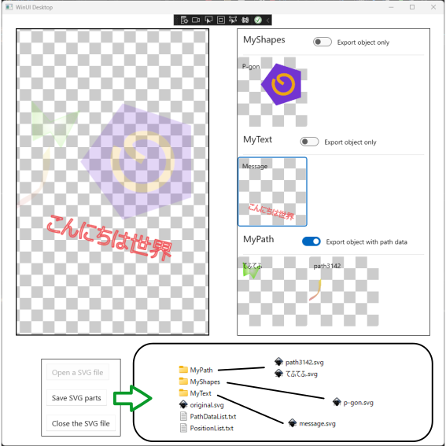

# SVGObjectsDecomposer

Decomposing tool of a single SVG (Scalable Vector Graphics) file into the multiple components:

- SVG file of a decomposed object
- Bounding box (x, y, width, height)
- PathData (if needed)

Screenshot

## Requirements

- Inkscape

## Usage

The tool requires a layered structure in a SVG file for the decomposition.

e.g.,

- layer1
    - object_a
    - object_b
- layer2
    - object_c
    - group_i
        - object_d
    - layer21

Group and nested layer are treated as a single object, respectively.

Try to load the containing [sample images](./samples/) for testing the tool. 

## TODO

- Improve UI (such as the progressbar in processing)
- Generate XAML file for MAUI
- Enable to customize the output 
- In-tool preview